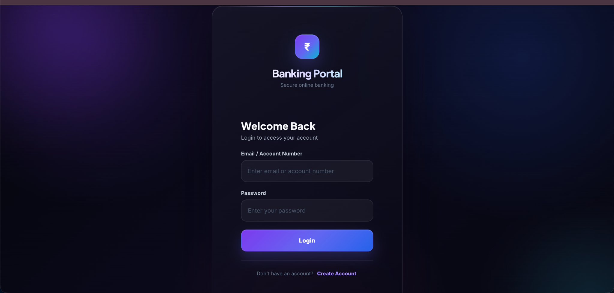
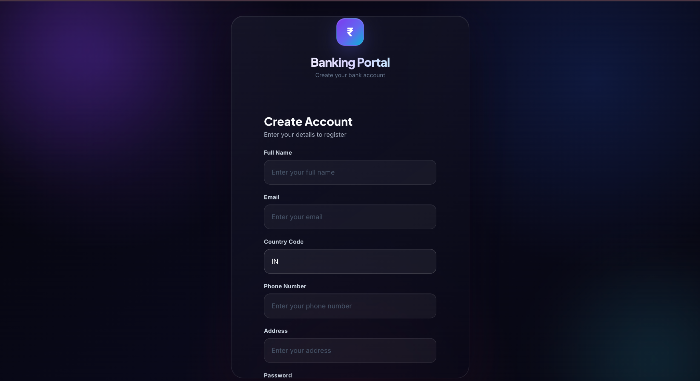
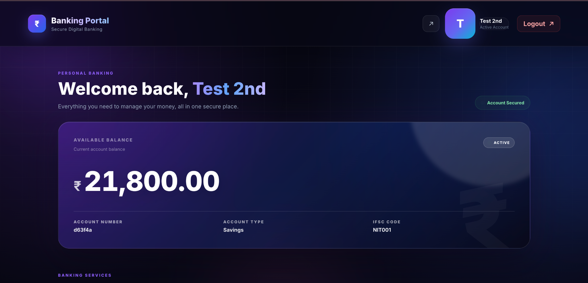
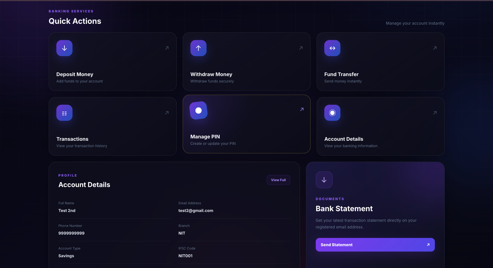

# 🏦 Banking Portal

A full-stack banking portal application built with **Spring Boot, Spring Security, JWT, MySQL, and React + Vite**.

The project is divided into two major parts:

- **Backend** — Spring Boot REST API
- **Frontend** — React + Vite banking interface

It provides user registration, authentication, OTP/email verification, PIN management, account management, cash deposit, cash withdrawal, fund transfer, and transaction history.

---

## ✨ Features

### 🔐 Authentication & Security
- User registration
- User login
- Spring Security authentication
- JWT-based authorization
- OTP/email verification
- Password encoding
- Secure PIN management
- Protected banking endpoints

### 🏦 Banking Operations
- Cash deposit
- Cash withdrawal
- Fund transfer
- Account balance management
- Transaction history
- Account details
- PIN creation and update
- Bank statement functionality

### 👤 Account Management
Users can view and manage:
- Personal information
- Account number
- Account type
- Available balance
- Branch information
- IFSC information
- Account security/status

### 📧 OTP & Email
The backend includes OTP and email functionality for verification and email-based operations using Spring Mail/SMTP.

### ⚠️ Error Handling
The backend contains custom exception handling for situations such as:
- Account not found
- Unauthorized access
- Invalid amount
- Invalid PIN
- Insufficient balance
- Invalid/expired token
- Other banking/API failures

---

# 🛠️ Tech Stack

## Backend

| Technology | Purpose |
|---|---|
| Java | Programming language |
| Spring Boot | Backend framework |
| Spring Web | REST APIs |
| Spring Data JPA | Database access |
| Hibernate | ORM |
| Spring Security | Authentication & authorization |
| JWT | Token-based authentication |
| Spring Validation | Request validation |
| Spring Mail | Email/OTP |
| Spring Cache | Caching |
| Redis | Cache support |
| Caffeine Cache | Local caching |
| MySQL | Relational database |
| MapStruct | DTO/entity mapping |
| Lombok | Boilerplate reduction |
| Maven | Build & dependency management |

## Frontend

| Technology | Purpose |
|---|---|
| React | UI development |
| Vite | Development/build tool |
| JavaScript | Programming language |
| CSS | Styling |
| npm | Package management |

---

# 📂 Project Structure

```text
Banking-Portal/
│
├── backend/
│   ├── src/
│   ├── pom.xml
│   ├── mvnw
│   ├── Dockerfile
│   └── README.md
│
├── frontend/
│   ├── public/
│   ├── src/
│   ├── screenshots/
│   ├── package.json
│   ├── package-lock.json
│   └── README.md
│
├── .gitignore
└── README.md
```

> The exact source-file structure can vary as the project evolves.

---

# 🏗️ Architecture

```text
                         ┌─────────────────────┐
                         │      React + Vite   │
                         │       Frontend      │
                         └──────────┬──────────┘
                                    │
                                    │ HTTP / REST API
                                    ▼
                         ┌─────────────────────┐
                         │     Spring Boot     │
                         │       Backend       │
                         └──────────┬──────────┘
                                    │
              ┌─────────────────────┼─────────────────────┐
              │                     │                     │
              ▼                     ▼                     ▼
       ┌─────────────┐      ┌─────────────┐      ┌─────────────┐
       │   Spring    │      │     JWT     │      │    MySQL    │
       │   Security  │      │     Auth    │      │   Database  │
       └─────────────┘      └─────────────┘      └─────────────┘
```

---

# 🧱 Backend Architecture

The backend follows a layered Spring Boot architecture.

```text
Controller
    ↓
Service
    ↓
Repository
    ↓
MySQL Database
```

Additional layers/components include:

- Entity layer
- DTO layer
- Mapper layer
- Exception handling
- Security layer
- Validation
- Caching
- OTP/email services

### Controller Layer
Handles HTTP requests and exposes REST endpoints.

### Service Layer
Contains business logic for:
- Authentication
- Users
- Accounts
- PIN validation
- Deposits
- Withdrawals
- Transfers
- Transactions
- OTP operations

### Repository Layer
Uses Spring Data JPA to communicate with MySQL.

### Entity Layer
Represents database objects such as users, accounts, and transactions.

### DTO Layer
Transfers request and response data between the frontend and backend.

### Security Layer
Spring Security and JWT protect authenticated endpoints.

---

# 💾 Database

The local database used by the backend is:

```text
bankingapp
```

The application uses **MySQL + JPA/Hibernate** for persistence.

Example local configuration:

```properties
server.port=8180

spring.datasource.url=jdbc:mysql://localhost:3306/bankingapp
spring.datasource.username=YOUR_USERNAME
spring.datasource.password=YOUR_PASSWORD
```

> Do not commit real database credentials to GitHub.

---

# 🔐 Security

The project uses multiple security mechanisms:

- Spring Security
- JWT authentication
- Bearer token authorization
- Password encoding
- Transaction PIN
- OTP verification
- Protected REST endpoints
- Input validation

### 🔒 Keep these values private

Never commit the following to a public repository:

```text
MySQL password
Email password / app password
JWT secret
External API keys
Private credentials
```

Use environment variables or a private local configuration file instead.

---

# 🔄 Authentication Flow

```text
User
 │
 ▼
Registration
 │
 ▼
Login
 │
 ▼
OTP Verification
 │
 ▼
JWT Token
 │
 ▼
Authenticated Dashboard
 │
 ├── Account
 ├── Deposit
 ├── Withdraw
 ├── Transfer
 ├── Transactions
 └── PIN Management
```

---

# 💰 Banking Operation Flow

## Deposit

```text
User
 ↓
Deposit Request
 ↓
Authentication
 ↓
Validate Amount
 ↓
Update Account Balance
 ↓
Create Transaction
 ↓
Database
```

## Withdrawal

```text
User
 ↓
Withdrawal Request
 ↓
Authentication
 ↓
PIN Validation
 ↓
Check Available Balance
 ↓
Withdraw Amount
 ↓
Create Transaction
 ↓
Database
```

## Fund Transfer

```text
Sender
 ↓
Transfer Request
 ↓
Authentication
 ↓
Validate Sender
 ↓
Validate Receiver
 ↓
Check Balance
 ↓
Transfer Amount
 ↓
Create Transaction Records
 ↓
Database
```

---

# 🌐 API & Frontend Integration

The frontend communicates with the Spring Boot backend through REST APIs.

```text
React Frontend
      │
      │ HTTP Requests
      ▼
Spring Boot REST API
      │
      ├── Authentication
      ├── Users
      ├── Accounts
      ├── Deposits
      ├── Withdrawals
      ├── Transfers
      ├── Transactions
      └── PIN Management
             │
             ▼
           MySQL
```

---

# ⚙️ Installation & Setup

## 1. Clone the Repository

```bash
git clone https://github.com/waniowais03/Banking-Portal.git
cd Banking-Portal
```

---

# 🔧 Backend Setup

Navigate to the backend:

```bash
cd backend
```

Make sure MySQL is running.

Create a database named:

```text
bankingapp
```

Configure the local application properties:

```text
src/main/resources/application.properties
```

Use your own local database credentials and other required secrets.

---

## 🚀 Start Backend

From the `backend` directory:

```bash
./mvnw spring-boot:run
```

If PMD causes a build issue during development:

```bash
./mvnw spring-boot:run -Dpmd.skip=true
```

The backend is configured to run on:

```text
http://localhost:8180
```

---

## 🧪 Backend Tests

```bash
./mvnw test
```

---

## 📦 Backend Build

```bash
./mvnw clean package
```

---

# 🌐 Frontend Setup

Open another terminal.

From the project root:

```bash
cd frontend
```

Install dependencies:

```bash
npm install
```

Start the development server:

```bash
npm run dev
```

Vite will display the local development URL in the terminal.

Usually:

```text
http://localhost:5173
```

Use the exact URL shown by Vite if your configuration uses another port.

---

## 🏗️ Frontend Production Build

```bash
npm run build
```

Preview the production build:

```bash
npm run preview
```

---

# 📸 Screenshots

The screenshots below show the current frontend interface.

## 🔐 Login



---

## 📝 Registration



---

## 📊 Dashboard



---

## ⚡ Dashboard — Quick Actions



---

## 👤 Account Details


---

## 💵 Deposit


---

## 💸 Withdraw


---

## 🔄 Fund Transfer


---

## 📜 Transactions


---

## 🔑 PIN Management


---

# 👨‍💻 Main User Flow

```text
Register
   ↓
Login
   ↓
OTP Verification
   ↓
Dashboard
   ├── Account Details
   ├── Deposit Cash
   ├── Withdraw Cash
   ├── Fund Transfer
   ├── Transaction History
   └── PIN Management
```

---

# 📚 Documentation

Detailed documentation is also maintained separately inside the project:

```text
backend/README.md
frontend/README.md
```

The root README provides an overall overview of the complete full-stack project.

---

# 🐳 Docker

The backend includes Docker-related configuration.

Relevant files may include:

```text
Dockerfile
docker/docker-compose.yml
```

These can be used for containerized development/deployment depending on the current project configuration.

---

# 🧪 Development Checklist

Before running the complete application:

```text
☐ MySQL is running
☐ bankingapp database exists
☐ Backend credentials are configured
☐ JWT configuration is configured
☐ Email/OTP configuration is configured if required
☐ Backend is running on port 8180
☐ Frontend dependencies are installed
☐ Frontend API/base URL points to the backend
```

---

# 📌 Important Notes

- Start the backend before testing frontend features that require API calls.
- Keep secrets outside the public repository.
- Do not commit real passwords, PINs, JWT secrets, API keys, or email credentials.
- If testing from another device on the same Wi-Fi network, `localhost` refers to that device, so the backend URL may need to use the host computer's local IP address.
- Frontend and backend are maintained as separate applications inside this repository.

---

# 🎯 Project Purpose

This project demonstrates the practical development of a modern full-stack banking application.

It covers:

- REST API development
- React frontend development
- Spring Boot
- Spring Security
- JWT authentication
- MySQL database integration
- JPA/Hibernate
- OTP/email verification
- Account management
- Banking transactions
- PIN management
- Exception handling
- Caching
- Frontend/backend integration

---

# 👨‍💻 Author

**Owais Wani**

GitHub:  
https://github.com/waniowais03

Repository:  
https://github.com/waniowais03/Banking-Portal

---

# ⭐ Support

If you find this project useful or interesting, consider giving the repository a ⭐ on GitHub.

---

## 📜 License

This project is developed for educational and project purposes.
