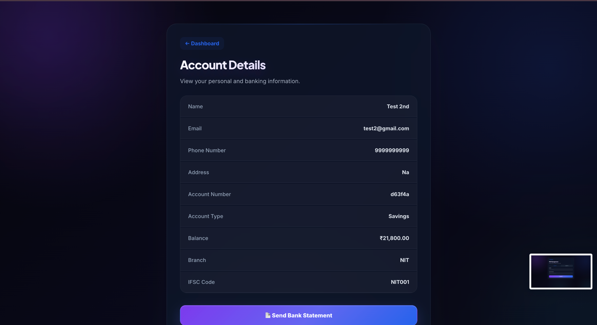
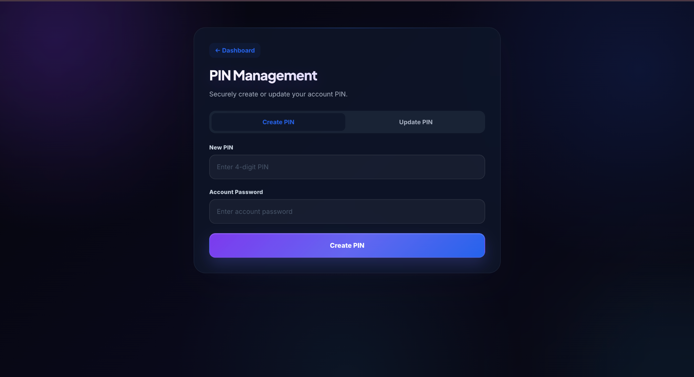
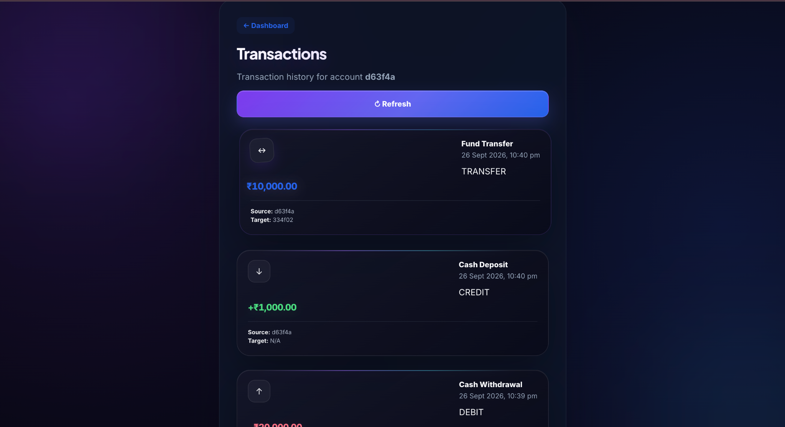
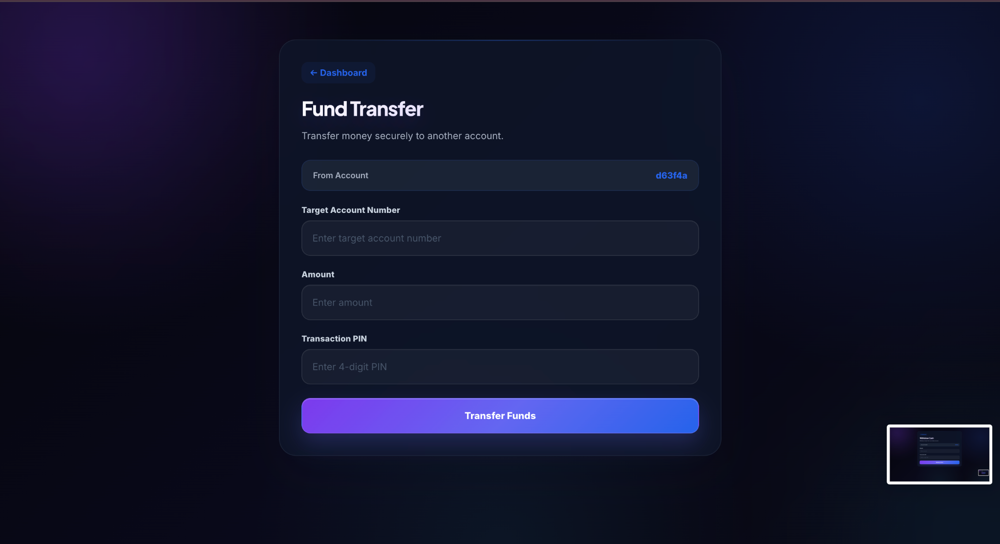
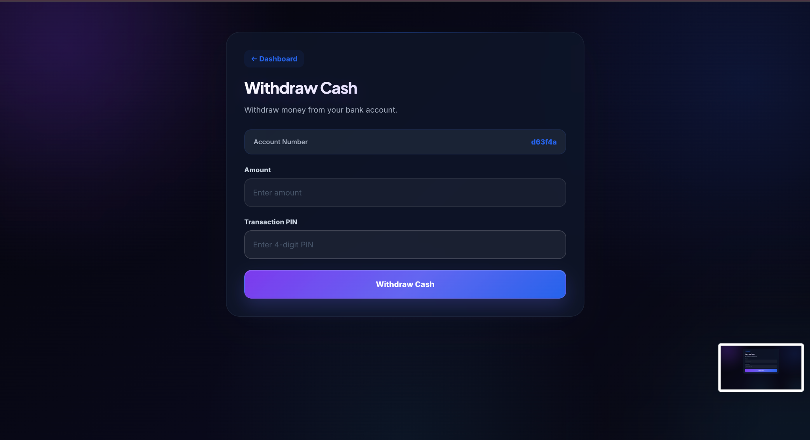
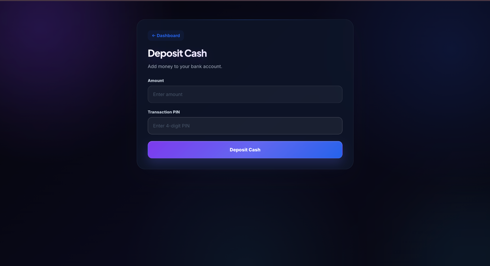

# 🏦 Banking Portal – Frontend

A modern and secure **Banking Portal frontend** built using **React.js and Vite**.

The application provides a clean digital banking interface where users can create accounts, log in, view account information, manage their PIN, deposit and withdraw cash, transfer funds, and view transaction history.

---

## ✨ Features

- 🔐 User Login
- 📝 Create New Bank Account
- 👤 User Dashboard
- 💰 View Available Balance
- 🏦 View Account Details
- 🔢 Create and Update PIN
- 💵 Deposit Cash
- 💸 Withdraw Cash
- 🔄 Fund Transfer
- 📊 Transaction History
- 📄 Bank Statement Request
- 🚪 Secure Logout
- 📱 Responsive and modern UI
- 🌙 Dark-themed banking interface
- 🎨 Modern gradient-based design
- ⚡ Fast development with Vite

---

## 🛠️ Technologies Used

### Frontend

- React.js
- Vite
- JavaScript
- HTML5
- CSS3

### Development Tools

- VS Code
- npm
- Git & GitHub

---

## 📂 Project Structure

```text
frontend/
│
├── public/
│
├── src/
│   ├── assets/
│   ├── components/
│   ├── pages/
│   ├── services/
│   ├── App.jsx
│   └── main.jsx
│
├── screenshots/
│   ├── Dashboard.png
│   ├── Dashboard2.png
│   ├── Deposit.png
│   ├── Withdraw.png
│   ├── account.png
│   ├── login.png
│   ├── pin-management.png
│   ├── register.png
│   ├── transactions.png
│   └── transfer.png
│
├── index.html
├── package.json
├── package-lock.json
├── vite.config.js
├── eslint.config.js
└── README.md
```

---

# 🚀 Getting Started

Follow these steps to run the frontend locally.

## 1. Clone the Repository

```bash
git clone <YOUR-GITHUB-REPOSITORY-URL>
```

## 2. Navigate to the Frontend Directory

```bash
cd frontend
```

## 3. Install Dependencies

```bash
npm install
```

## 4. Start the Development Server

```bash
npm run dev
```

The application will be available at the local URL shown in the terminal, usually:

```text
http://localhost:5173
```

---

# 📸 Screenshots

## 🔐 Login

The login page allows users to access their banking account using their email/account number and password.


---

## 📝 Create Account

Users can create a new banking account by entering their personal and account information.


---

## 🏦 Dashboard

The main dashboard provides an overview of the user's account, available balance, account number, account type and IFSC code.


---

## 📊 Dashboard – Quick Actions

The dashboard provides quick access to important banking services such as deposits, withdrawals, fund transfers, transactions, PIN management and account details.


---

## 👤 Account Details

Users can view their personal information and complete banking account details.



---

## 🔢 PIN Management

Users can securely create or update their banking PIN.



---

## 📜 Transactions

The transactions page displays the user's transaction history, including deposits, withdrawals and fund transfers.



---

## 🔄 Fund Transfer

Users can transfer money to another bank account by entering the target account number, amount and transaction PIN.



---

## 💸 Withdraw Cash

Users can withdraw money from their bank account by entering the amount and transaction PIN.



---

## 💰 Deposit Cash

Users can add money to their bank account using the deposit functionality.



---

# 🔐 Banking Operations

The frontend provides interfaces for the following banking operations:

| Operation | Description |
|---|---|
| Create Account | Register a new banking user |
| Login | Authenticate an existing user |
| Dashboard | View account overview |
| Account Details | View personal and banking information |
| Deposit | Add money to the account |
| Withdraw | Withdraw money from the account |
| Fund Transfer | Transfer money to another account |
| Transactions | View transaction history |
| PIN Management | Create or update transaction PIN |
| Bank Statement | Request account statement |
| Logout | Exit the authenticated session |

---

# 🎨 User Interface

The application uses a modern banking interface featuring:

- Dark theme
- Purple and blue gradients
- Glass-style cards
- Modern typography
- Interactive buttons
- Banking-focused icons
- Clean dashboard layout
- Responsive components

---

# 🔗 Backend Integration

This frontend is designed to communicate with the **Banking Portal backend API** for authentication and banking operations.

Backend services can handle operations such as:

- User registration
- User authentication
- Account management
- PIN management
- Cash deposits
- Cash withdrawals
- Fund transfers
- Transaction history
- Bank statement services

Make sure the backend server is running and properly configured before using API-dependent features.

---

# ⚙️ Available Scripts

### Start Development Server

```bash
npm run dev
```

### Build for Production

```bash
npm run build
```

### Preview Production Build

```bash
npm run preview
```

### Run ESLint

```bash
npm run lint
```

---

# 📦 Production Build

To create a production build:

```bash
npm run build
```

The optimized production files will be generated inside:

```text
dist/
```

---

# 🧪 Development

During development, Vite provides:

- Fast development server
- Hot Module Replacement (HMR)
- Fast rebuilds
- Modern JavaScript support

---

# 🔒 Security

The application includes interfaces for secure banking operations such as:

- Account authentication
- Password-protected login
- Transaction PIN verification
- Protected banking operations
- Secure logout
- Account-specific transaction information

> **Note:** Never use real banking credentials or sensitive financial information while testing or demonstrating the application.

---

# 👨‍💻 Developer

**Owais Wani**

B.Tech Computer Science & Engineering

---

# 📌 Project Status

**Status:** 🚀 Active Development

The Banking Portal frontend is continuously being improved with additional UI enhancements, banking features and backend integrations.

---

## ⭐ Support

If you find this project useful, consider giving the repository a ⭐ on GitHub.

---

**© 2026 Banking Portal – Frontend**